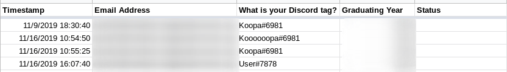
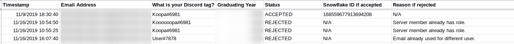

# LionBot
LionBot is a Discord bot uniquely featuring integration with Google, allowing for a coherent infrastructure joining Google Accounts with Discord accounts. Its command structure is borrowed from [Bold and Bash](https://gitlab.com/mk8mc/web/bold-and-bash).

## Setup

### Prerequisites
- [Git](https://git-scm.com/) is required to clone this repository.
- [Docker](https://www.docker.com/) is required to run LionBot in a containerized environment.
- [Node.js](https://nodejs.org/) is required, alternatively to Docker, to run LionBot directly on the host.

### Instructions

#### Discord Setup
1. Create a Discord server.
2. Modify the `@everyone` role to take away the `Send Messages` permission in the `Text Permissions` section.
3. Make 4 roles (These must be named exactly how they are typed here, unless noted otherwise.):
- The `Admins` role. These are administrators, the staff with the most power. The permissions are up to you.
- The `Moderators` role. These are moderators, staff members with less power than the administrators. The permissions are up to you.
- The Bold and Bash role (The name of this role is up to you.). This is the bot's role. The permissions must grant:
  - `Read Text Channels & See Voice Channels` to receive commands.
  - `Send Text Messages` to respond to commands.
  - `Manage Roles` for the verification process.
  - `Manage Messages` to delete entered commands that ended successfully, and clean up the verification channel.
- The `Verified` role. The permissions should have everything except for `Send Messages` **disabled**, with `Send Messages` itself **enabled**.
1. Make 3 text channels in addition to the default `#general` channel (The names are up to you.):
- The welcome channel. This contains info about the server. The permissions are up to you.
- The report channel. This is where the bot reports events related to verification as well as mod mail. The permissions must be:
  - `@everyone` is denied the `Read Messages` permission.
  - `Admins`, `Moderators`, and the bot are granted the `Read Messages` permission.
5. Make a bot user using [this](https://discordapp.com/developers/docs/intro) guide.
6. Invite the bot to the server using [this](https://discordapp.com/developers/docs/topics/oauth2#bot-authorization-flow) guide. For the permissions, just use `0`, because you already have made a role with the bot's permissions.
7. Give the bot role to the newly invited bot.

#### Google Setup
1. Obtain Google OAuth client credentials using [this](https://developers.google.com/identity/protocols/OAuth2) guide. For starting out, the [Node.js Quickstart](https://developers.google.com/sheets/api/quickstart/nodejs) may be easier to use.
2. Save the credentials JSON.

#### Bot Setup
1. Open up a terminal or command prompt.
2. Clone the `lionbot` repository:
```bash
git clone https://gitlab.com/CodingKoopa/lionbot.git
```
3. Enter the `lionbot` directory:
```bash
cd lionbot
```
4. Make an environment file (e.g. `.env`) setting the configuration variables specified in [`env.json`](env.json). Any fields for which default variables are provided may be omitted. Example excerpt:
```bash
LB_LOGGING_LEVEL=Debug
LB_DISCORD_TOKEN=ASFldsDFjk7DFkmslmk9Dmlm.DFnlsi.DFDSMKLSDFK_dfDSF8h7vjkjDFd
```

The next steps depend on whether or not you are using Docker.

##### Bot Setup with Docker
In this section, there will be two code samples for each step:
- A Bash command for use with with the Docker CLI.
- A [Docker Compose](https://docs.docker.com/compose/overview/) `yml` configuration, with `version: "3.7"`.

Which one of these two you follow depends on whether or not you use Docker Compose in your setup. **Either way, the Docker excerpts should be combined into a final command or `yml`.**

1. Run the bot (read the following steps before running this!):
```bash
docker run --env-file .env registry.gitlab.com/codingkoopa/lionbot/amd64:stable
```
```yml
services:
  lionbot:
    image: registry.gitlab.com/codingkoopa/lionbot/amd64:stable
    env_file: /opt/lionbot/.env
```
2. Make the bot restart if it crashes (Optional.):
```bash
docker run --restart on-failure
```
```yml
services:
  lionbot:
    restart: on-failure
```
3. Use the `Data` mount point to create a volume:
```bash
docker run --mount type=volume,source=lionbot-data,target=/usr/src/app/Data
```
```yml
services:
  lionbot:
    volumes:
      - type: volume
        source: lionbot-data
        target: /usr/src/app/Data
```

##### Bot Setup without Docker
1. Export the configuration variables. This can be done by turning the aforementioned environment file into a script that exports the variables, or a Bash function like so:
```bash
# Exports the contents of an "ENV" file.
# Arguments:
#   - The path to the "ENV" file.
function export-env
{
  set -o allexport
  # shellcheck disable=1090
  source "$1"
  set +o allexport
}
```
2. Install the Node.js dependencies with the [NPM](https://www.npmjs.com/) package manager:
```bash
npm install
```
3. Run the bot:
```bash
npm run start
```

##### Bot Initialization
1. Copy the credentials JSON, from [Google Setup](#google-setup), to `Data/GoogleOAuthCredentials.json`. If using Docker, the path to `Data` can be found by running a command like `docker volume inspect --format '{{ .Mountpoint }}' lionbot-data`.
2. Follow the link to have the bot create `Data/GoogleOAuthToken.json`.

#### Building
LionBot Docker images are automatically built by [GitLab CI/CD](https://docs.gitlab.com/ee/ci/) and uploaded to the [GitLab Container Registry](https://docs.gitlab.com/ee/user/packages/container_registry/), but it can be built manually:
```sh
docker build . -t lionbot
```
```yml
services:
  lionbot:
    build: .
```

## Contributing
If you are interested in working on the bot's code, follow these steps to get a development environment up and running:
1. Follow [Discord Setup](#discord-setup) again, creating a separate Discord server, and separate bot account.
2. Create a new environment file with the development bot account info.
3. It's recommended to start the bot using `npm`, and the Bash function above:
```bash
export-env .env && clear && npm run start
```
4. When you've made your changes, use [ESLint](https://eslint.org/) to check them for errors:
```bash
npm run lint
```

## Features
A full list of commands be found by running the `help` command.

### Google Sheets Integration
LionBot's [Google Sheets](https://www.google.com/sheets/about/) integration follows a pipeline to a Google Sheet for Discord user verification.
- Users submit a form via a [Google Form](https://www.google.com/forms/about/).
- Google automatically translates the data to a Google Sheet spreadsheet:


- LionBot fetches the cells of the spreadsheet. This is done when the bot is started, and when the `process` command is ran from Discord. Additionally, every 10 minutes the bot will check to see whether a change has been made to the file, and if so fetch the cells again.
- LionBot filters the results to users whose status is blank, as shown above. These users have had their submission neither approved nor rejected, as they haven't yet been processed by the bot. This is the **user queue**.
- LionBot runs the **user queue** through two passes:
  - Pass 1, Discord verification. This pass puts users who aren't in the target server or who already have the role into the **reject queue**. Email verification is also performed at this point, for limiting users to a domain. Users passing these tests go into the **accept queue**.
  - Pass 2, Google verification. This pass cross references the emails of the users in the **accept queue** with users with status `VERIFIED` in the spreadsheet. To prevent using one email for multiple accounts, users that test positive here are put into the **reject queue**.
- LionBot processes the queues:
  - On Discord, LionBot grants the roles to users in the **accept queue**, and DMs the user with info and a success message. LionBot DMs the users in the **reject queue** if possible. In both cases, the action is logged in the report channel.
  - On Google Sheets, LionBot populates the sheets with the processed users' statuses, and snowflake ID if accepted, or reject reason if not accepted:



## License
LionBot is licensed under the GNU General Public License v2.0.
